Income Prediction
================
Trevor Okinda
2024

- [Student Details](#student-details)
- [Setup Chunk](#setup-chunk)
  - [Source:](#source)
  - [Reference:](#reference)
- [Understanding the Dataset (Exploratory Data Analysis
  (EDA))](#understanding-the-dataset-exploratory-data-analysis-eda)
  - [Loading the Dataset](#loading-the-dataset)
  - [Measures of Frequency](#measures-of-frequency)
  - [Measures of Central Tendency](#measures-of-central-tendency)
  - [Measures of Distribution](#measures-of-distribution)
  - [Measures of Relationship](#measures-of-relationship)
  - [ANOVA](#anova)
  - [Plots](#plots)
- [Preprocessing and Data
  Transformation](#preprocessing-and-data-transformation)
  - [Missing Values](#missing-values)
- [Training Models](#training-models)
  - [Data Splitting](#data-splitting)
  - [Bootstrapping](#bootstrapping)
  - [Cross-validation](#cross-validation)
  - [Training Different Models](#training-different-models)
  - [Performance Comparison](#performance-comparison)
  - [Saving Model](#saving-model)

# Student Details

|                       |                   |
|-----------------------|-------------------|
| **Student ID Number** | 134780            |
| **Student Name**      | Trevor Okinda     |
| **BBIT 4.2 Group**    | C                 |
| **Project Name**      | Income Prediction |

# Setup Chunk

**Note:** the following KnitR options have been set as the global
defaults: <BR>
`knitr::opts_chunk$set(echo = TRUE, warning = FALSE, eval = TRUE, collapse = FALSE, tidy = TRUE)`.

More KnitR options are documented here
<https://bookdown.org/yihui/rmarkdown-cookbook/chunk-options.html> and
here <https://yihui.org/knitr/options/>.

### Source:

The dataset that was used can be downloaded here: *\<<a
href="https://www.kaggle.com/datasets/aldol07/socioeconomic-factors-and-income-dataset/data\"
class="uri">https://www.kaggle.com/datasets/aldol07/socioeconomic-factors-and-income-dataset/data\</a>\>*

### Reference:

*\<aldol07. (n.d.). Socioeconomic Factors and Income Dataset \[Data
set\]. Kaggle. <a
href="https://www.kaggle.com/datasets/aldol07/socioeconomic-factors-and-income-dataset\"
class="uri">https://www.kaggle.com/datasets/aldol07/socioeconomic-factors-and-income-dataset\</a>\>  
Refer to the APA 7th edition manual for rules on how to cite datasets:
<https://apastyle.apa.org/style-grammar-guidelines/references/examples/data-set-references>*

# Understanding the Dataset (Exploratory Data Analysis (EDA))

## Loading the Dataset

``` r
# Load customer data with specified column classes
CustomerData <- read.csv("sgdata.csv", colClasses = c(
  Sex = "factor",                  # 0 or 1, treat as categorical
  Marital_status = "factor",      # single or non-single
  Age = "numeric",
  Education = "factor",           # high school or university
  Income = "numeric",
  Occupation = "factor",          # skilled employee or unemployed
  Settlement_size = "factor"      # 0, 1, 2 - treat as categorical size class
))

# View the structure of the dataset
str(CustomerData)
```

    ## 'data.frame':    2000 obs. of  7 variables:
    ##  $ Sex            : Factor w/ 2 levels "0","1": 1 2 1 1 1 1 1 1 1 1 ...
    ##  $ Marital_status : Factor w/ 2 levels "non-single ",..: 2 1 2 2 2 2 2 2 1 1 ...
    ##  $ Age            : num  67 22 49 45 53 35 53 35 61 28 ...
    ##  $ Education      : Factor w/ 4 levels "graduate school",..: 4 2 2 2 2 2 2 2 4 2 ...
    ##  $ Income         : num  124670 150773 89210 171565 149031 ...
    ##  $ Occupation     : Factor w/ 3 levels "management ",..: 2 2 3 2 2 3 2 1 3 1 ...
    ##  $ Settlement_size: Factor w/ 3 levels "0","1","2": 3 3 1 2 2 1 2 2 1 1 ...

``` r
# Preview the data
head(CustomerData)
```

    ##   Sex Marital_status Age   Education Income        Occupation Settlement_size
    ## 1   0         single  67  university 124670 skilled employee                2
    ## 2   1    non-single   22 high school 150773 skilled employee                2
    ## 3   0         single  49 high school  89210       unemployed                0
    ## 4   0         single  45 high school 171565 skilled employee                1
    ## 5   0         single  53 high school 149031 skilled employee                1
    ## 6   0         single  35 high school 144848       unemployed                0

``` r
View(CustomerData)
```

## Measures of Frequency

``` r
# Measures of Frequency
# Frequency of each category
table(CustomerData$Sex)
```

    ## 
    ##    0    1 
    ## 1086  914

``` r
table(CustomerData$Marital_status)
```

    ## 
    ## non-single       single 
    ##         993        1007

``` r
table(CustomerData$Education)
```

    ## 
    ## graduate school     high school           other      university 
    ##              36            1386             287             291

``` r
table(CustomerData$Occupation)
```

    ## 
    ##       management  skilled employee        unemployed  
    ##               254              1113               633

``` r
table(CustomerData$Settlement_size)
```

    ## 
    ##   0   1   2 
    ## 989 544 467

``` r
# Proportions
prop.table(table(CustomerData$Sex))
```

    ## 
    ##     0     1 
    ## 0.543 0.457

``` r
prop.table(table(CustomerData$Marital_status))
```

    ## 
    ## non-single       single 
    ##      0.4965      0.5035

## Measures of Central Tendency

``` r
# Measures of Central Tendency
# Mean
mean(CustomerData$Age)
```

    ## [1] 35.909

``` r
mean(CustomerData$Income)
```

    ## [1] 120954.4

``` r
# Median
median(CustomerData$Age)
```

    ## [1] 33

``` r
median(CustomerData$Income)
```

    ## [1] 115548.5

``` r
# Mode function (custom)
get_mode <- function(x) {
  ux <- unique(x)
  ux[which.max(tabulate(match(x, ux)))]
}

get_mode(CustomerData$Age)
```

    ## [1] 26

``` r
get_mode(CustomerData$Income)
```

    ## [1] 214364

## Measures of Distribution

``` r
# Measures of Distribution
# Range
range(CustomerData$Age)
```

    ## [1] 18 76

``` r
range(CustomerData$Income)
```

    ## [1]  35832 309364

``` r
# Standard Deviation
sd(CustomerData$Age)
```

    ## [1] 11.7194

``` r
sd(CustomerData$Income)
```

    ## [1] 38108.82

``` r
# Variance
var(CustomerData$Age)
```

    ## [1] 137.3444

``` r
var(CustomerData$Income)
```

    ## [1] 1452282518

``` r
# Skewness and Kurtosis (need e1071 package)
library(e1071)

skewness(CustomerData$Income)
```

    ## [1] 1.194292

``` r
kurtosis(CustomerData$Income)
```

    ## [1] 2.858706

## Measures of Relationship

``` r
# Measures of Relationship
# Correlation between Age and Income
cor(CustomerData$Age, CustomerData$Income)
```

    ## [1] 0.3406102

``` r
# Cross-tabulation between categorical variables
table(CustomerData$Sex, CustomerData$Marital_status)
```

    ##    
    ##     non-single  single
    ##   0         257    829
    ##   1         736    178

``` r
# Visualization (optional, if you're using plots)
plot(CustomerData$Age, CustomerData$Income, main="Age vs Income", xlab="Age", ylab="Income")
```

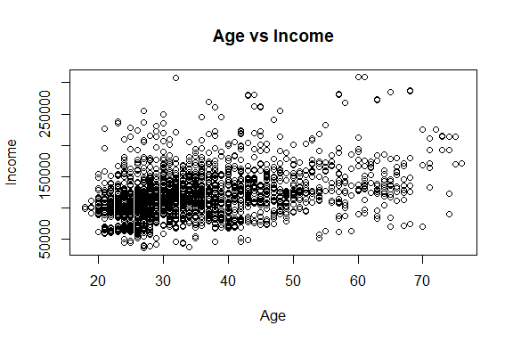<!-- -->

## ANOVA

``` r
# One-way ANOVA: Does Income differ by Education level?
anova_edu <- aov(Income ~ Education, data = CustomerData)
summary(anova_edu)
```

    ##               Df    Sum Sq   Mean Sq F value Pr(>F)    
    ## Education      3 2.372e+11 7.906e+10   59.19 <2e-16 ***
    ## Residuals   1996 2.666e+12 1.336e+09                   
    ## ---
    ## Signif. codes:  0 '***' 0.001 '**' 0.01 '*' 0.05 '.' 0.1 ' ' 1

``` r
# One-way ANOVA: Does Income differ by Occupation?
anova_occ <- aov(Income ~ Occupation, data = CustomerData)
summary(anova_occ)
```

    ##               Df    Sum Sq   Mean Sq F value Pr(>F)    
    ## Occupation     2 1.372e+12 6.861e+11     895 <2e-16 ***
    ## Residuals   1997 1.531e+12 7.666e+08                   
    ## ---
    ## Signif. codes:  0 '***' 0.001 '**' 0.01 '*' 0.05 '.' 0.1 ' ' 1

``` r
# One-way ANOVA: Does Income differ by Sex?
anova_sex <- aov(Income ~ Sex, data = CustomerData)
summary(anova_sex)
```

    ##               Df    Sum Sq   Mean Sq F value Pr(>F)    
    ## Sex            1 1.106e+11 1.106e+11    79.1 <2e-16 ***
    ## Residuals   1998 2.793e+12 1.398e+09                   
    ## ---
    ## Signif. codes:  0 '***' 0.001 '**' 0.01 '*' 0.05 '.' 0.1 ' ' 1

``` r
# Tukey HSD post-hoc test
TukeyHSD(anova_edu)
```

    ##   Tukey multiple comparisons of means
    ##     95% family-wise confidence level
    ## 
    ## Fit: aov(formula = Income ~ Education, data = CustomerData)
    ## 
    ## $Education
    ##                                   diff        lwr        upr     p adj
    ## high school-graduate school -30450.613 -46314.064 -14587.162 0.0000052
    ## other-graduate school       -31750.121 -48364.718 -15135.524 0.0000058
    ## university-graduate school   -1412.351 -18014.215  15189.514 0.9963065
    ## other-high school            -1299.508  -7393.559   4794.544 0.9470266
    ## university-high school       29038.263  22979.009  35097.517 0.0000000
    ## university-other             30337.770  22520.462  38155.078 0.0000000

``` r
TukeyHSD(anova_occ)
```

    ##   Tukey multiple comparisons of means
    ##     95% family-wise confidence level
    ## 
    ## Fit: aov(formula = Income ~ Occupation, data = CustomerData)
    ## 
    ## $Occupation
    ##                                    diff       lwr       upr p adj
    ## skilled employee -management  -50729.39 -55245.12 -46213.66     0
    ## unemployed -management        -85366.63 -90190.01 -80543.25     0
    ## unemployed -skilled employee  -34637.24 -37870.06 -31404.43     0

``` r
# Boxplot to visualize income differences
boxplot(Income ~ Education, data = CustomerData, main = "Income by Education", col = "lightblue")
```

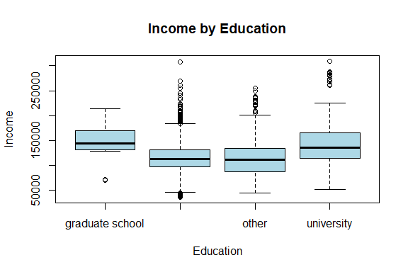<!-- -->

``` r
boxplot(Income ~ Occupation, data = CustomerData, main = "Income by Occupation", col = "lightgreen")
```

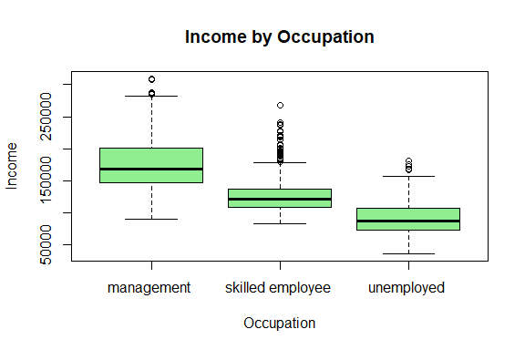<!-- -->

## Plots

``` r
# Load ggplot2
library(ggplot2)

# Bar plot for Education
ggplot(CustomerData, aes(x = Education)) +
  geom_bar(fill = "steelblue") +
  ggtitle("Frequency of Education Levels")
```

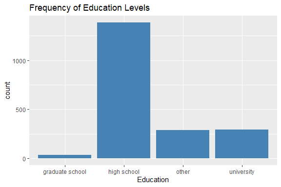<!-- -->

``` r
# Bar plot for Occupation
ggplot(CustomerData, aes(x = Occupation)) +
  geom_bar(fill = "darkgreen") +
  ggtitle("Frequency of Occupation")
```

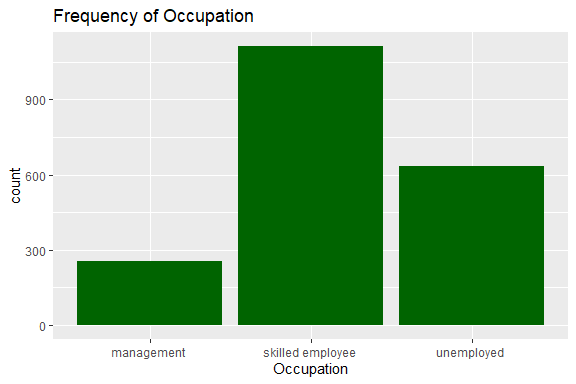<!-- -->

``` r
# Histogram for Income
ggplot(CustomerData, aes(x = Income)) +
  geom_histogram(fill = "orange", bins = 10) +
  ggtitle("Histogram of Income")
```

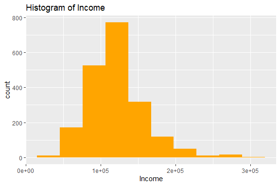<!-- -->

``` r
# Boxplot for Age
ggplot(CustomerData, aes(y = Age)) +
  geom_boxplot(fill = "purple") +
  ggtitle("Boxplot of Age")
```

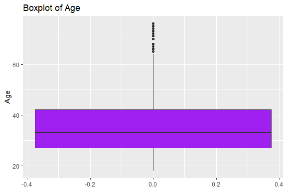<!-- -->

``` r
ggplot(CustomerData, aes(x = Age, y = Income)) +
  geom_point(color = "dodgerblue") +
  ggtitle("Age vs Income")
```

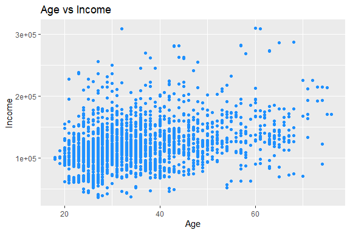<!-- -->

``` r
ggplot(CustomerData, aes(x = Education, y = Income)) +
  geom_boxplot(fill = "salmon") +
  ggtitle("Income by Education")
```

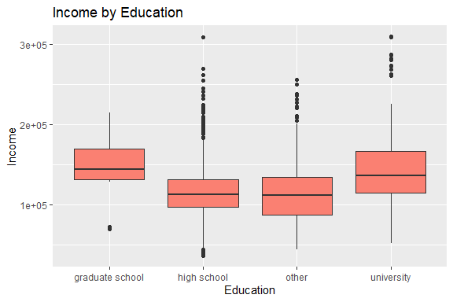<!-- -->

``` r
ggplot(CustomerData, aes(x = Age, y = Income, color = Sex)) +
  geom_point(size = 3) +
  ggtitle("Age vs Income by Sex")
```

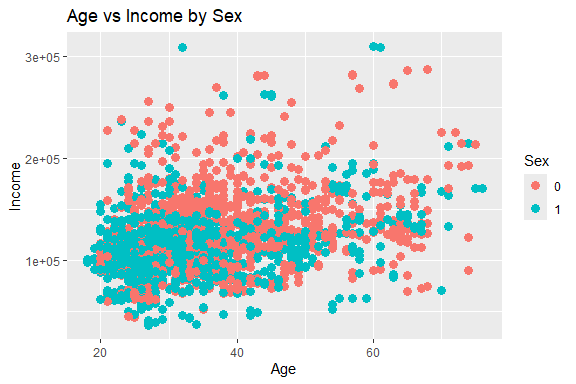<!-- -->

``` r
ggplot(CustomerData, aes(x = Education, fill = Marital_status)) +
  geom_bar(position = "stack") +
  ggtitle("Education by Marital Status")
```

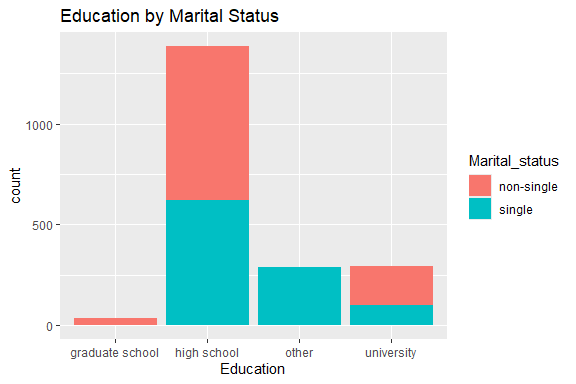<!-- -->

# Preprocessing and Data Transformation

## Missing Values

``` r
# Are there any missing values?
anyNA(CustomerData)
```

    ## [1] FALSE

``` r
# Total number of missing values in the dataset
sum(is.na(CustomerData))
```

    ## [1] 0

``` r
# Number of missing values per column
colSums(is.na(CustomerData))
```

    ##             Sex  Marital_status             Age       Education          Income 
    ##               0               0               0               0               0 
    ##      Occupation Settlement_size 
    ##               0               0

``` r
# Install and load the visdat package (if not already)
library(visdat)

# Visualize missing data
vis_miss(CustomerData)
```

<!-- -->

# Training Models

## Data Splitting

``` r
# Install package if needed
library(caTools)

# Set seed for reproducibility
set.seed(123)

# Split: 70% training, 30% testing
split <- sample.split(CustomerData$Income, SplitRatio = 0.7)

# Create training and test sets
train_data <- subset(CustomerData, split == TRUE)
test_data <- subset(CustomerData, split == FALSE)

# Check sizes
nrow(train_data)
```

    ## [1] 1400

``` r
nrow(test_data)
```

    ## [1] 600

## Bootstrapping

``` r
# Install and load the boot package
library(boot)

# Bootstrapping function (for linear regression)
boot_fn <- function(data, indices) {
  boot_data <- data[indices, ]
  model <- lm(Income ~ Age + Education + Occupation, data = boot_data)
  return(coef(model))  # Return coefficients (you can return other stats)
}

# Bootstrapping with 1000 iterations
set.seed(123)
boot_results <- boot(data = train_data, statistic = boot_fn, R = 1000)

# Summary of bootstrap results
summary(boot_results)
```

    ##           Length Class      Mode     
    ## t0           7   -none-     numeric  
    ## t         7000   -none-     numeric  
    ## R            1   -none-     numeric  
    ## data         7   data.frame list     
    ## seed       626   -none-     numeric  
    ## statistic    1   -none-     function 
    ## sim          1   -none-     character
    ## call         4   -none-     call     
    ## stype        1   -none-     character
    ## strata    1400   -none-     numeric  
    ## weights   1400   -none-     numeric

## Cross-validation

``` r
library(caret)
```

    ## Loading required package: lattice

    ## 
    ## Attaching package: 'lattice'

    ## The following object is masked from 'package:boot':
    ## 
    ##     melanoma

``` r
# Set the seed for reproducibility
set.seed(123)

# Define cross-validation settings
train_control <- trainControl(method = "cv", number = 5)  # 5-fold cross-validation

# Train a linear regression model with cross-validation
model <- train(Income ~ Age + Education + Occupation, data = train_data, 
               method = "lm", trControl = train_control)

# View the model results (e.g., RMSE, Rsquared)
print(model)
```

    ## Linear Regression 
    ## 
    ## 1400 samples
    ##    3 predictor
    ## 
    ## No pre-processing
    ## Resampling: Cross-Validated (5 fold) 
    ## Summary of sample sizes: 1120, 1120, 1120, 1120, 1120 
    ## Resampling results:
    ## 
    ##   RMSE      Rsquared   MAE     
    ##   25631.77  0.5619143  19150.56
    ## 
    ## Tuning parameter 'intercept' was held constant at a value of TRUE

``` r
# Cross-validation results: RMSE, R^2, and MAE (Mean Absolute Error)
model$results
```

    ##   intercept     RMSE  Rsquared      MAE   RMSESD RsquaredSD    MAESD
    ## 1      TRUE 25631.77 0.5619143 19150.56 1440.704 0.03981732 724.3867

## Training Different Models

``` r
# Train a linear regression model with 5-fold cross-validation
set.seed(123)

train_control <- trainControl(method = "cv", number = 5)  # 5-fold cross-validation

# Linear regression model
lm_model <- train(Income ~ Age + Education + Occupation, data = train_data, 
                  method = "lm", trControl = train_control)

# Display the model summary
print(lm_model)
```

    ## Linear Regression 
    ## 
    ## 1400 samples
    ##    3 predictor
    ## 
    ## No pre-processing
    ## Resampling: Cross-Validated (5 fold) 
    ## Summary of sample sizes: 1120, 1120, 1120, 1120, 1120 
    ## Resampling results:
    ## 
    ##   RMSE      Rsquared   MAE     
    ##   25631.77  0.5619143  19150.56
    ## 
    ## Tuning parameter 'intercept' was held constant at a value of TRUE

``` r
# Evaluate model performance
lm_model$results  # RMSE, Rsquared, MAE
```

    ##   intercept     RMSE  Rsquared      MAE   RMSESD RsquaredSD    MAESD
    ## 1      TRUE 25631.77 0.5619143 19150.56 1440.704 0.03981732 724.3867

``` r
# Train a Random Forest model with 5-fold cross-validation
set.seed(123)

rf_model <- train(Income ~ Age + Education + Occupation, data = train_data, 
                  method = "rf", trControl = train_control)

# Display the model summary
print(rf_model)
```

    ## Random Forest 
    ## 
    ## 1400 samples
    ##    3 predictor
    ## 
    ## No pre-processing
    ## Resampling: Cross-Validated (5 fold) 
    ## Summary of sample sizes: 1120, 1120, 1120, 1120, 1120 
    ## Resampling results across tuning parameters:
    ## 
    ##   mtry  RMSE      Rsquared   MAE     
    ##   2     26072.76  0.5596691  19313.22
    ##   4     25504.72  0.5655670  19069.82
    ##   6     26470.66  0.5384055  19759.58
    ## 
    ## RMSE was used to select the optimal model using the smallest value.
    ## The final value used for the model was mtry = 4.

``` r
# Evaluate model performance
rf_model$results  # RMSE, Rsquared, MAE
```

    ##   mtry     RMSE  Rsquared      MAE   RMSESD RsquaredSD    MAESD
    ## 1    2 26072.76 0.5596691 19313.22 1641.281 0.05089501 964.0084
    ## 2    4 25504.72 0.5655670 19069.82 1740.000 0.05745922 903.4159
    ## 3    6 26470.66 0.5384055 19759.58 1650.915 0.06155703 825.8867

``` r
# Train a Gradient Boosting Machine (GBM) model with 5-fold cross-validation
set.seed(123)

gbm_model <- train(Income ~ Age + Education + Occupation, data = train_data, 
                   method = "gbm", trControl = train_control, verbose = FALSE)

# Display the model summary
print(gbm_model)
```

    ## Stochastic Gradient Boosting 
    ## 
    ## 1400 samples
    ##    3 predictor
    ## 
    ## No pre-processing
    ## Resampling: Cross-Validated (5 fold) 
    ## Summary of sample sizes: 1120, 1120, 1120, 1120, 1120 
    ## Resampling results across tuning parameters:
    ## 
    ##   interaction.depth  n.trees  RMSE      Rsquared   MAE     
    ##   1                   50      28312.46  0.4969711  20662.88
    ##   1                  100      26317.75  0.5477560  19424.70
    ##   1                  150      25861.32  0.5565363  19253.65
    ##   2                   50      25565.77  0.5657784  19108.30
    ##   2                  100      25419.40  0.5688035  19081.04
    ##   2                  150      25460.70  0.5670042  19103.03
    ##   3                   50      25396.46  0.5692997  19080.10
    ##   3                  100      25422.89  0.5676387  19136.49
    ##   3                  150      25465.38  0.5666494  19189.10
    ## 
    ## Tuning parameter 'shrinkage' was held constant at a value of 0.1
    ## 
    ## Tuning parameter 'n.minobsinnode' was held constant at a value of 10
    ## RMSE was used to select the optimal model using the smallest value.
    ## The final values used for the model were n.trees = 50, interaction.depth =
    ##  3, shrinkage = 0.1 and n.minobsinnode = 10.

``` r
# Evaluate model performance
gbm_model$results  # RMSE, Rsquared, MAE
```

    ##   shrinkage interaction.depth n.minobsinnode n.trees     RMSE  Rsquared
    ## 1       0.1                 1             10      50 28312.46 0.4969711
    ## 4       0.1                 2             10      50 25565.77 0.5657784
    ## 7       0.1                 3             10      50 25396.46 0.5692997
    ## 2       0.1                 1             10     100 26317.75 0.5477560
    ## 5       0.1                 2             10     100 25419.40 0.5688035
    ## 8       0.1                 3             10     100 25422.89 0.5676387
    ## 3       0.1                 1             10     150 25861.32 0.5565363
    ## 6       0.1                 2             10     150 25460.70 0.5670042
    ## 9       0.1                 3             10     150 25465.38 0.5666494
    ##        MAE   RMSESD RsquaredSD    MAESD
    ## 1 20662.88 1570.398 0.02367851 829.5257
    ## 4 19108.30 1470.637 0.03571086 816.9740
    ## 7 19080.10 1547.227 0.04165701 834.2718
    ## 2 19424.70 1429.706 0.02981032 724.7709
    ## 5 19081.04 1409.452 0.03444353 712.0815
    ## 8 19136.49 1585.376 0.04168965 794.5015
    ## 3 19253.65 1375.287 0.03268582 683.6335
    ## 6 19103.03 1486.667 0.03537729 732.4059
    ## 9 19189.10 1577.006 0.04067823 775.7965

## Performance Comparison

``` r
# Compare models by RMSE
results <- resamples(list(LM = lm_model, RF = rf_model, GBM = gbm_model))

# Summary of model performance
summary(results)
```

    ## 
    ## Call:
    ## summary.resamples(object = results)
    ## 
    ## Models: LM, RF, GBM 
    ## Number of resamples: 5 
    ## 
    ## MAE 
    ##         Min.  1st Qu.   Median     Mean  3rd Qu.     Max. NA's
    ## LM  18365.70 18602.35 19167.53 19150.56 19411.09 20206.14    0
    ## RF  18293.54 18465.53 18621.90 19069.82 19523.32 20444.80    0
    ## GBM 18154.54 18365.45 19166.59 19080.10 19539.03 20174.88    0
    ## 
    ## RMSE 
    ##         Min.  1st Qu.   Median     Mean  3rd Qu.     Max. NA's
    ## LM  24400.03 24520.43 25276.92 25631.77 26036.04 27925.44    0
    ## RF  23949.58 24866.86 25040.53 25504.72 25169.08 28497.54    0
    ## GBM 23753.44 24373.81 25095.38 25396.46 26061.65 27698.03    0
    ## 
    ## Rsquared 
    ##          Min.   1st Qu.    Median      Mean   3rd Qu.      Max. NA's
    ## LM  0.5020896 0.5463352 0.5706102 0.5619143 0.5847947 0.6057417    0
    ## RF  0.4837820 0.5321885 0.5906022 0.5655670 0.5917238 0.6295388    0
    ## GBM 0.5083371 0.5441501 0.5912100 0.5692997 0.5963375 0.6064639    0

``` r
# Visualize the comparison
bwplot(results)
```

<!-- -->

## Saving Model

``` r
# Save the GBM model to a file
saveRDS(gbm_model, "./models/saved_gbm_model.rds")

# Load the saved GBM model
loaded_gbm_model <- readRDS("./models/saved_gbm_model.rds")

# Example of new data for prediction (adjust this to match your dataset)
new_data <- data.frame(
  Sex = factor(0, levels = levels(train_data$Sex)),                  # Sex as factor (0 or 1)
  Marital_status = factor("single", levels = levels(train_data$Marital_status)),  # single or non-single
  Age = 40,
  Education = factor("high school", levels = levels(train_data$Education)),  # Make sure this matches your training data levels
  Occupation = factor("skilled employee", levels = levels(train_data$Occupation)),  # Adjust for valid categories in the model
  Settlement_size = factor(1, levels = levels(train_data$Settlement_size))  # Settlement_size as factor (0, 1, 2)
)

# Use the loaded GBM model to make predictions
predictions_loaded_model <- predict(loaded_gbm_model, newdata = new_data)

# Print the predictions
print(predictions_loaded_model)
```

    ## numeric(0)

``` r
#Debugging
# Check the loaded model
print(loaded_gbm_model)
```

    ## Stochastic Gradient Boosting 
    ## 
    ## 1400 samples
    ##    3 predictor
    ## 
    ## No pre-processing
    ## Resampling: Cross-Validated (5 fold) 
    ## Summary of sample sizes: 1120, 1120, 1120, 1120, 1120 
    ## Resampling results across tuning parameters:
    ## 
    ##   interaction.depth  n.trees  RMSE      Rsquared   MAE     
    ##   1                   50      28312.46  0.4969711  20662.88
    ##   1                  100      26317.75  0.5477560  19424.70
    ##   1                  150      25861.32  0.5565363  19253.65
    ##   2                   50      25565.77  0.5657784  19108.30
    ##   2                  100      25419.40  0.5688035  19081.04
    ##   2                  150      25460.70  0.5670042  19103.03
    ##   3                   50      25396.46  0.5692997  19080.10
    ##   3                  100      25422.89  0.5676387  19136.49
    ##   3                  150      25465.38  0.5666494  19189.10
    ## 
    ## Tuning parameter 'shrinkage' was held constant at a value of 0.1
    ## 
    ## Tuning parameter 'n.minobsinnode' was held constant at a value of 10
    ## RMSE was used to select the optimal model using the smallest value.
    ## The final values used for the model were n.trees = 50, interaction.depth =
    ##  3, shrinkage = 0.1 and n.minobsinnode = 10.

``` r
# Check the structure of new_data
str(new_data)
```

    ## 'data.frame':    1 obs. of  6 variables:
    ##  $ Sex            : Factor w/ 2 levels "0","1": 1
    ##  $ Marital_status : Factor w/ 2 levels "non-single ",..: 2
    ##  $ Age            : num 40
    ##  $ Education      : Factor w/ 4 levels "graduate school",..: 2
    ##  $ Occupation     : Factor w/ 3 levels "management ",..: NA
    ##  $ Settlement_size: Factor w/ 3 levels "0","1","2": 2

``` r
# Check for missing values in new_data
any(is.na(new_data))
```

    ## [1] TRUE

``` r
# Identify which columns have missing values in new_data
colSums(is.na(new_data))
```

    ##             Sex  Marital_status             Age       Education      Occupation 
    ##               0               0               0               0               1 
    ## Settlement_size 
    ##               0

``` r
# Replace missing value in Occupation with the most frequent value
most_frequent_occupation <- names(sort(table(new_data$Occupation), decreasing = TRUE))[1]
new_data$Occupation[is.na(new_data$Occupation)] <- most_frequent_occupation

# Make predictions again after handling missing values
predictions_loaded_model <- predict(loaded_gbm_model, newdata = new_data)

# Print predictions
print(predictions_loaded_model)
```

    ## [1] 162255.7
